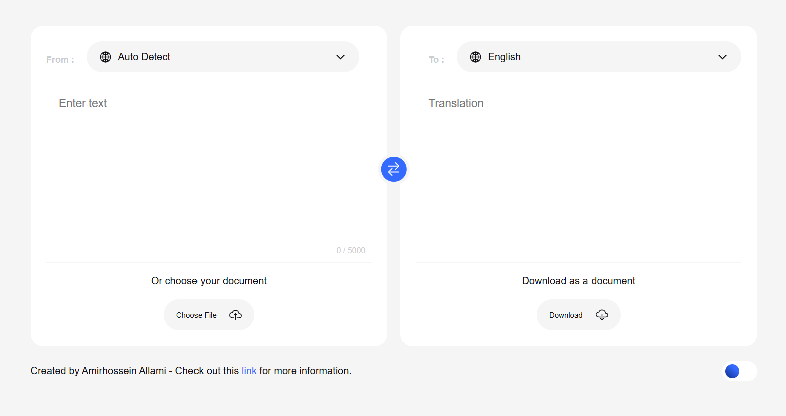

# 🌍 English Language Translator

A modern, feature-rich English-to-multiple-languages translation web application built with vanilla JavaScript, HTML, and CSS. This project was developed for the CODEXINTERN Front-End Development program.



## ✨ Features

### 🚀 Core Translation
- **English Input Only**: Simple and focused - enter text in English only
- **100+ Target Languages**: Translate English to 100+ languages including major world languages
- **Real-time Translation**: Instant translation as you type with debouncing
- **RapidAPI Integration**: Primary translation service via Microsoft Translator API
- **Fallback Support**: Google Translate API as backup service

### 🎨 Modern UI/UX
- **Responsive Design**: Works perfectly on desktop, tablet, and mobile devices
- **Dark/Light Mode**: Toggle between dark and light themes
- **Smooth Animations**: Beautiful hover effects and transitions
- **Modern Typography**: Clean, readable Inter font
- **Intuitive Interface**: User-friendly design with clear visual hierarchy

### 🔧 Advanced Features
- **Voice Input**: Speak to translate using speech recognition
- **Text-to-Speech**: Listen to translations in the target language
- **File Upload**: Upload text files (.txt) for translation
- **Copy to Clipboard**: One-click copy of translated text
- **Download Translations**: Save translations as text files
- **Character Counter**: Real-time character count with visual feedback
- **Language Swap**: Quick swap between input and output languages

### ⌨️ Keyboard Shortcuts
- `Ctrl + Enter`: Translate text
- `Ctrl + S`: Download translation
- `Ctrl + C`: Copy translation (when output textarea is focused)
- `Ctrl + K`: Manage RapidAPI key

### 📱 Mobile Optimized
- Touch-friendly interface
- Responsive grid layout
- Optimized for mobile browsers
- Voice input support on mobile devices

## 🛠️ Technologies Used

- **HTML5**: Semantic markup and modern HTML features
- **CSS3**: Custom properties, Grid, Flexbox, animations
- **Vanilla JavaScript**: ES6+ features, classes, async/await
- **RapidAPI**: Microsoft Translator API for translation services
- **Google Translate API**: Fallback translation service
- **Web Speech API**: Speech recognition and synthesis
- **Ionicons**: Beautiful icon library

## 🚀 Getting Started

### Prerequisites
- Modern web browser (Chrome, Firefox, Safari, Edge)
- Internet connection for translation API
- RapidAPI account and API key (free tier available)
- Microphone access for voice features (optional)

### Installation
1. Clone or download the repository
2. Open `index.html` in your web browser
3. Get your RapidAPI key (see setup instructions below)
4. Enter your API key when prompted
5. Start translating!

### Local Development
```bash
# Clone the repository
git clone <repository-url>

# Navigate to the project directory
cd language-translator-main

# Open in your preferred code editor
code .

# Open index.html in your browser
# Or use a local server
python -m http.server 8000
# Then visit http://localhost:8000
```

## 📖 How to Use

### Setup RapidAPI (First Time Only)
1. **Visit RapidAPI**: Go to [https://rapidapi.com](https://rapidapi.com)
2. **Create Account**: Sign up for a free account
3. **Subscribe to Translator**: Search for "Microsoft Translator" or "Google Translate API"
4. **Get API Key**: Copy your RapidAPI key from the dashboard
5. **Enter Key**: Paste your API key when prompted in the app
6. **Start Translating**: Your key is saved locally for future use

### Basic Translation
1. **Enter English Text**: Type or paste English text in the left textarea
2. **Select Target Language**: Choose your desired target language from the dropdown
3. **Get Translation**: Translation appears automatically in the right textarea

### Advanced Features

#### Voice Input
- Click the microphone button in the input area
- Speak clearly into your microphone
- Your speech will be converted to text and translated

#### Text-to-Speech
- Click the speaker button in the output area
- Listen to the translation in the target language

#### File Upload
- Click the document icon in the input area
- Select a .txt file to upload
- File content will be loaded for translation

#### Simplified Interface
- **English Input Only**: No need to select input language - always English
- **Target Language Selection**: Choose from 100+ target languages
- **Clean Design**: Removed unnecessary complexity for better user experience

#### Dark Mode
- Toggle the dark mode switch in the header
- Your preference is saved for future visits

#### API Key Management
- Press `Ctrl + K` to change your RapidAPI key
- Your API key is stored locally for security
- App works with fallback service if no API key is provided

## 🎯 Key Improvements Made

### Code Quality
- **Object-Oriented Design**: Refactored to use ES6 classes
- **Modular Architecture**: Clean separation of concerns
- **Error Handling**: Comprehensive error handling and user feedback
- **Performance**: Debounced API calls and optimized rendering

### User Experience
- **Loading States**: Visual feedback during translation
- **Toast Notifications**: Non-intrusive status messages
- **Accessibility**: ARIA labels and keyboard navigation
- **Progressive Enhancement**: Graceful degradation for unsupported features

### Visual Design
- **Modern Color Scheme**: Professional blue theme with proper contrast
- **Consistent Spacing**: Using CSS custom properties for design tokens
- **Smooth Animations**: Subtle hover effects and transitions
- **Mobile-First**: Responsive design that works on all devices

## 🔧 API Integration

### Primary: RapidAPI (Microsoft Translator)
The application primarily uses Microsoft Translator API via RapidAPI:
```
https://microsoft-translator-text.p.rapidapi.com/translate
```

### Fallback: Google Translate API
If no RapidAPI key is provided, the app falls back to Google Translate:
```
https://translate.googleapis.com/translate_a/single?client=gtx&sl={source}&tl={target}&dt=t&q={text}
```

### API Features
- **RapidAPI Integration**: Professional translation service with API key
- **Fallback Support**: Google Translate as backup (no key required)
- **Rate Limiting**: Built-in debouncing to respect rate limits
- **Error Handling**: Graceful fallback for API failures
- **CORS Support**: Works in modern browsers
- **Local Storage**: API key saved locally for convenience

## 📱 Browser Support

- ✅ Chrome 60+
- ✅ Firefox 55+
- ✅ Safari 12+
- ✅ Edge 79+

### Feature Support
- **Speech Recognition**: Chrome, Edge, Safari
- **Speech Synthesis**: All modern browsers
- **Clipboard API**: Chrome, Firefox, Safari
- **File API**: All modern browsers

## 🎨 Customization

### Colors
Modify the CSS custom properties in `style/style.css`:
```css
:root {
  --primary-color: #3b82f6;
  --primary-hover: #2563eb;
  --success-color: #10b981;
  --warning-color: #f59e0b;
  --error-color: #ef4444;
  /* ... more variables */
}
```

### Languages
Add or modify languages in `js/languages.js`:
```javascript
const languages = [
  {
    no: "1",
    name: "Language Name",
    native: "Native Name",
    code: "lang-code"
  }
  // ... more languages
];
```

## 🐛 Troubleshooting

### Common Issues

**Translation not working?**
- Check your internet connection
- Verify your RapidAPI key is correct (press Ctrl+K to check)
- Try refreshing the page
- Ensure the text is not empty

**Voice input not working?**
- Check microphone permissions
- Use Chrome or Edge for best compatibility
- Ensure microphone is not muted

**Dark mode not saving?**
- Check if localStorage is enabled
- Try refreshing the page

**File upload issues?**
- Ensure file is .txt format
- Check file size (max 5000 characters)
- Try copying and pasting text instead

## 📄 License

This project is licensed under the MIT License - see the [LICENSE](LICENSE) file for details.

## 🤝 Contributing

1. Fork the repository
2. Create a feature branch (`git checkout -b feature/AmazingFeature`)
3. Commit your changes (`git commit -m 'Add some AmazingFeature'`)
4. Push to the branch (`git push origin feature/AmazingFeature`)
5. Open a Pull Request

## 🙏 Acknowledgments

- **RapidAPI** for translation services
- **Microsoft Translator API** for professional translation
- **Google Translate API** for fallback translation
- **Ionicons** for beautiful icons
- **Inter Font** for typography
- **CODEXINTERN** for the project opportunity

## 📞 Support

If you encounter any issues or have questions:
- Create an issue on GitHub
- Check the troubleshooting section above
- Ensure you're using a supported browser

---

**Built with ❤️ for CODEXINTERN Front-End Development Program**

*This project demonstrates modern web development practices, responsive design, and user experience best practices.*
